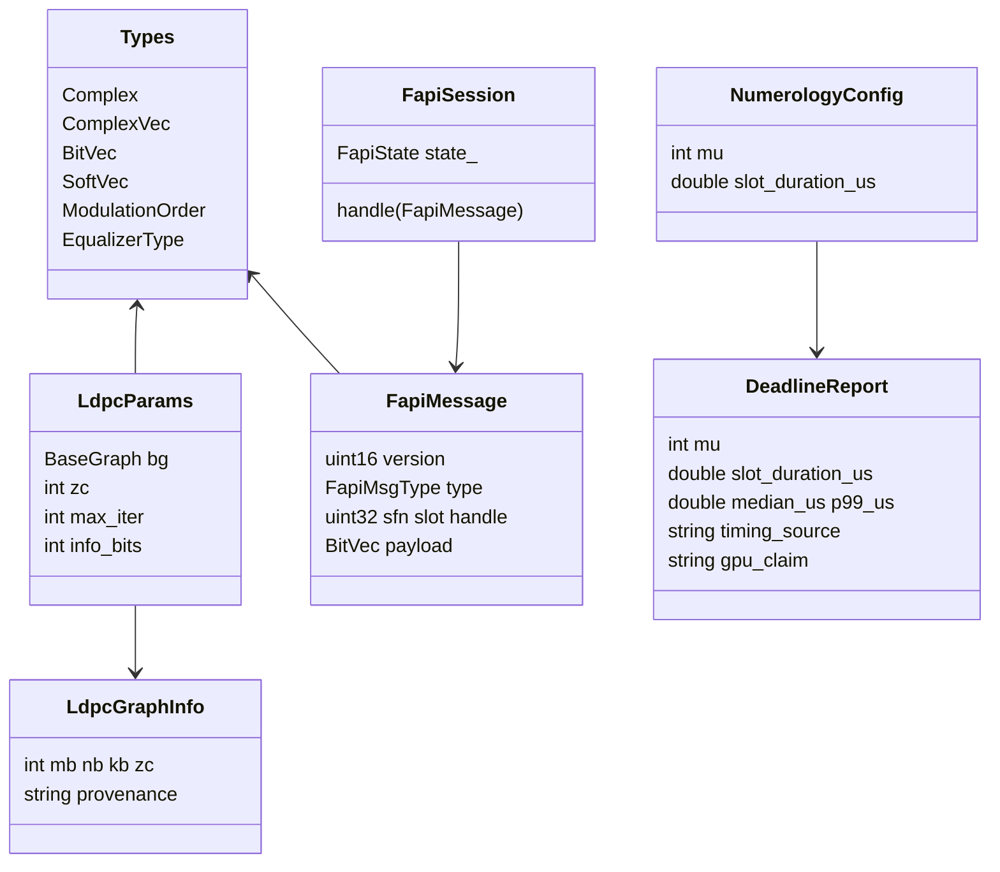

# Class — PHY / data (current)

Conceptual types in `include/nr_bb/`. Not a UML export of every function.

`DeadlineReport.timing_source` defaults to `cpu_synthetic`. The `gpu_claim` string forbids promoting CPU samples to GPU closure.
