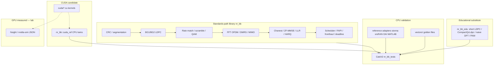

# Component — current

```mermaid
flowchart TB
  subgraph edu [Educational substitute]
    EDU[nr_bb_edu: short LDPC / CompactQcLdpc / naive DFT / PAM]
  end
  subgraph std [Standards-path library nr_bb]
    CRC[CRC / segmentation]
    LDPC[BG1/BG2 LDPC]
    RM[Rate match / scramble / QAM]
    OFDM[FFT OFDM / DMRS / MIMO]
    EQ[Chanest / ZF-MMSE / LLR / HARQ]
    MAC[Scheduler / FAPI / fronthaul / deadline]
  end
  subgraph val [CPU validation]
    T[Catch2 nr_bb_tests]
    V[vectors/ golden files]
    A[reference adapters sionna srsRAN OAI MATLAB]
  end
  subgraph cuda [CUDA candidate]
    CU[cuda/*.cu kernels]
    REF[nr_bb::cuda_ref CPU twins]
  end
  subgraph gpu [GPU measured — lab]
    NS[Nsight / nvidia-smi JSON]
  end
  EDU --> T
  CRC --> LDPC --> RM --> OFDM --> EQ --> MAC
  std --> T
  V --> T
  A --> T
  CU -.-> REF
  REF --> T
  CU -.-> NS
```

Educational targets link into tests only under the `EDUCATIONAL_ONLY` label. CUDA does not feed GPU-measured JSON on CPU-only hosts.
