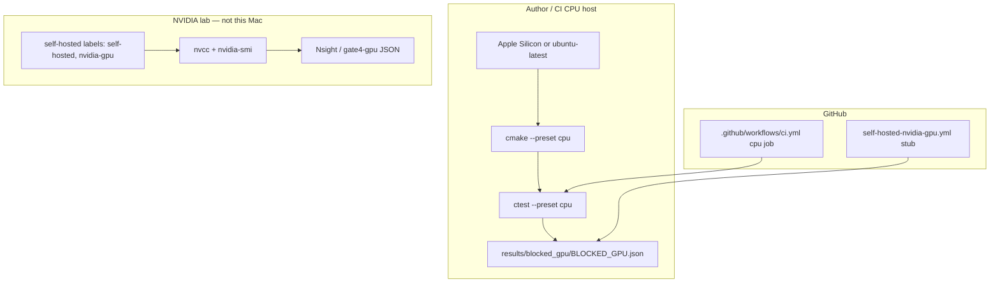

# Deployment — CPU vs GPU

The `gpu` CMake preset and `cuda/` sources are **candidates** on CPU-only machines. GitHub `ubuntu-latest` GPU jobs emit `BLOCKED_GPU_RUNNER` unless a labeled runner is attached.
