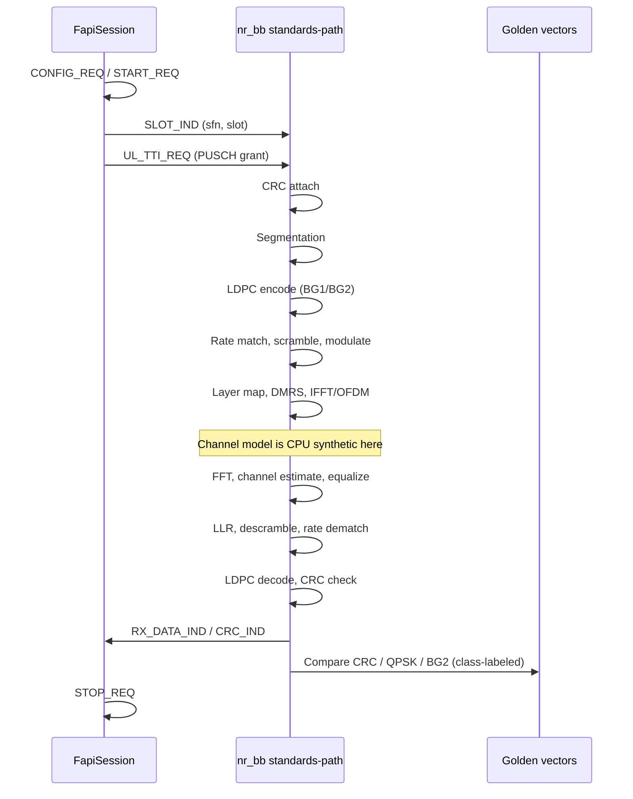

# Sequence — slot / PUSCH (CPU standards-path)

FAPI-like slot indication driving a PUSCH-oriented UL chain. This is the **implemented software order**, not a claim of a certified gNB.

Educational CompactQcLdpc / (16,8) is a **parallel** test path, not this sequence.
