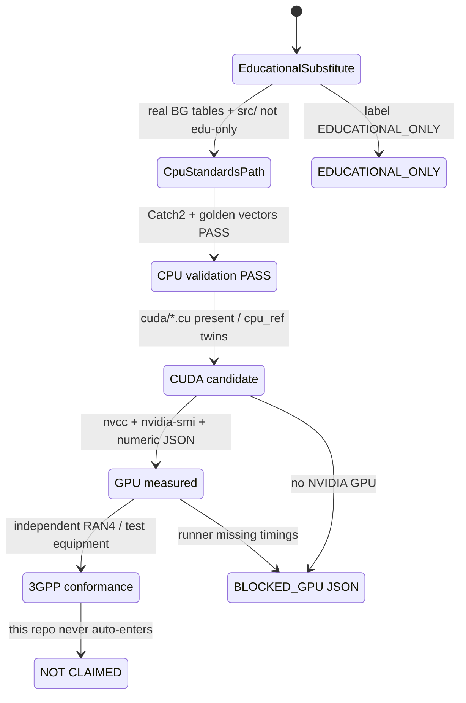

# State — validation-gate machine

Promotion is explicit and fail-closed. No automatic jump from CPU PASS to GPU measured or 3GPP.

`scripts/supervisor_cpu_gate.sh` records the reachable state on this host. Typical Apple Silicon: `CpuValidated` + `BlockedGpu`.
