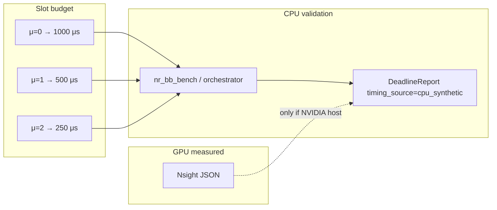
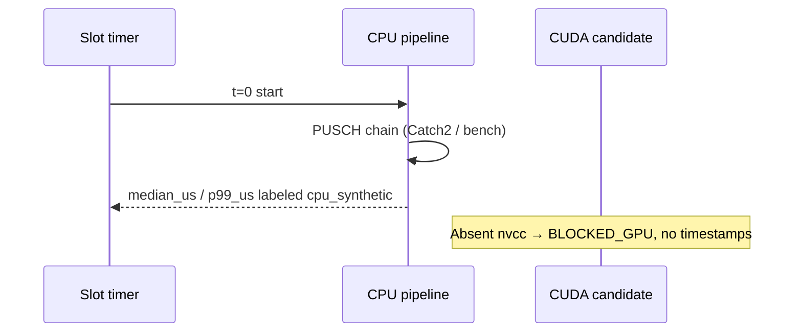

# Timing — numerology deadlines vs evidence class

CPU `deadline.hpp` derives slot duration from μ (`15·2^μ` kHz). Samples fed into `evaluate_deadlines` are **CPU synthetic** unless a GPU-measured JSON exists.

Never copy CPU microseconds into a GPU results file.
